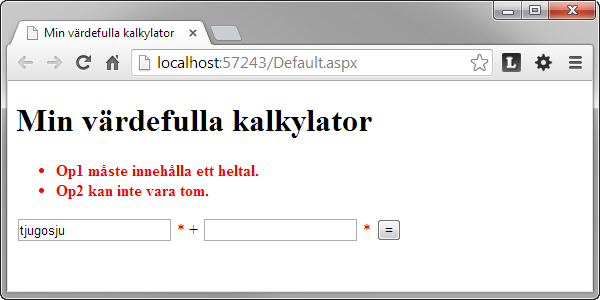

0. Introduktionsuppgift
=======================

[0-introduktionsuppgift.pdf](https://github.com/1dv406/kursmaterial/blob/master/Laborationsuppgifter/0-introduktionsuppgift.pdf)

"Du ska följa ”steg för steg”-instruktionen i denna introduktionsuppgift och skapa en ”ASP.NET Web Forms (Old School)”-applikation som kan addera två heltal en användare matar in i två textfält."
